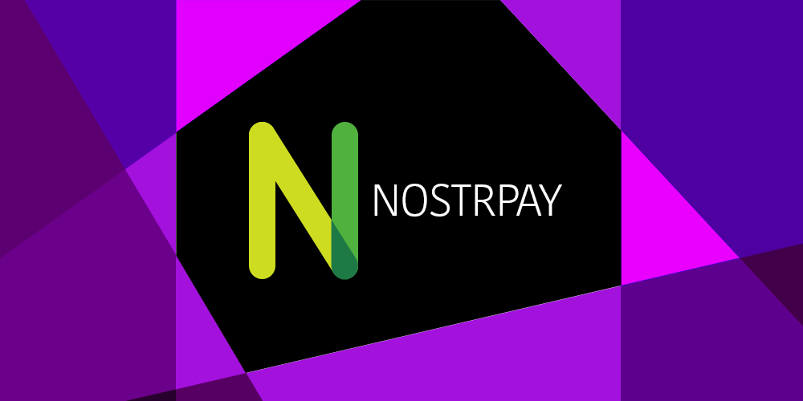

# NostrPayDM
Fun logo aside, NostrPayDM isn't really a thing; it's just a simple idea for how to run an on-chain bitcoin donation campaign via Nostr DMs.

This code is just an example proof of concept. Any Nostr client could easily implement this functionality.


## How does it work?
* User adds an xpub to their Nostr client.
* Nostr client generates a new PK that will be its NostrPayDM bot account.
* User publishes the npub of their NostrPayDM bot.
  * (perhaps as part of their Nostr metadata, ala `lnurl`)
* Donors DM the NostrPayDM bot for a new on-chain address.
* User's Nostr client checks the bot's DMs in the background
  * The user continues to use their client as usual; all of this is essentially invisible to the user.
* User's Nostr client uses the xpub and the bot's PK to reply to the DM requests and send the new address.
* User's Nostr client updates its internal address index count so it never re-uses an already revealed address.


## Goals
* Receive on-chain bitcoin without reusing addresses
* Keep bitcoin keys safely in cold storage
* Leverage Nostr DMs for close-enough-to-real-time interactions
* No server requirements. Just need it built into a Nostr client.


## Overview
Python script runs on an internet-connected device. But it's a "pull" model where it periodically checks for new incoming Nostr DMs.


## Setup
```
# Requires python 3.8+
git clone https://github.com/kdmukai/nostrpaydm.git
cd nostrpaydm

pip install virtualenv
virtualenv .env
source .env/bin/activate
